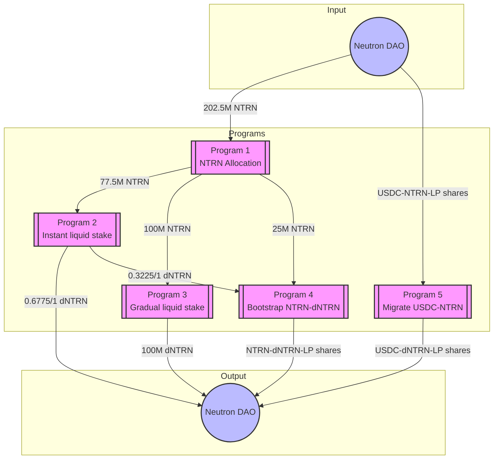

# Neutron dICS Programs

There are five programs Timewave is deploying to support Neutron's monetary policy as they become a sovereign Proof of Stake chain.
These include the following.

1. **NTRN Allocation Program**: This program receives 202.5M NTRN and allocates them to the other programs. See [program details](programs/2025-03-23-prod-dICS-ntrn-allocation/README.md).
2. **Instant liquid-stake NTRN Program**: This program receives 77.5M NTRN which is liquid staked using the Drop protocol immediately. A fraction of 0.6775, ~100M dNTRN is returned to the DAO. A fraction of 0.3225, ~25M dNTRN is sent to bootstrap NTRN and dNTRN liquidity, i.e., program 4. See [program details](programs/2025-03-23-prod-dICS-ntrn-instant-ls/README.md).
3. **Gradual liquid-stake NTRN program**: This program receives 100M NTRN and it liquid stakes these gradually over three months. See [program details](programs/2025-03-23-prod-dICS-gradual-ls/README.md).
4. **Bootstrap NTRN and dNTRN liquidity program**: This program receives NTRN from program 1 and dNTRN from program 2. It provides liquidity to the Astroport pool and returns the LP share tokens to the Neutron DAO. See [program details](programs/2025-03-23-prod-bootstrap-ntrn-dntrn-liquidity/README.md).
5. **Migrate USDC-NTRN liquidity program**: This program receives the USDC-NTRN liquidity LP tokens from the Neutron DAO. It withdraws the liquidity, liquid stakes the NTRN, and enters the USDC-dNTRN liquidity pool. Liquidity tokens are sent back to the Neutron DAO. See [program details](programs/2025-03-23-prod-migrate-usdc-ntrn-liquidity/README.md).

## Security Model

Each program implements a two-tier security model:

1. **Low Security Operations**
   - Authorized by addresses in the `operator_list`
   - Includes routine operations like:
     - Splitting NTRN
     - Liquid staking NTRN
     - Providing liquidity
     - Withdrawing liquidity
   - No call limits on authorized functions

2. **High Security Operations**
   - Requires authorization from either the Neutron DAO or the Security DAO
   - Includes critical operations like:
     - Updating program configurations
     - Returning unspent tokens
     - Modifying security parameters
   - No call limits on authorized functions

Each program maintains its own set of authorized operators and security parameters, but follows this consistent security model across all programs in the dICS initiative.

## Program Deployment Order

Due to dependencies in the programs, programs should be deployed in reverse order. The `program_param` TOML files will need to be updated with addresses from the programs.
- Program 5 is independent of programs 1-4
- Program 2 needs the receiver address for Program 4
- Program 1 needs receiver addresses for Programs 1, 2, and 3

## Testing and Rehearsals

## Mainnet Fork Deployment
Before using in production, please do the following:
1. Make a copy of `mainnet.toml` files in each program's `program_param` folder and give it a suitable name. A good name is `<test_date>_<chain_name>_<label>.toml`.
2. Ensure every subroutine from every program has been executed in the tests. Use the Subroutine Authorization Matrix to confirm test results.

Mainnet fork deployment checklist
1. Deployed. Program ID 12
  - Receiver address is `neutron1u3fsk7ycfmp8dpxdtxyrc8lgpqjk0w5xc82vqn9hdxnrru8jt3ssj7majv`
2. Deployed. Program ID 11
 - Receiver address is `neutron1yr6xedwtmfvqrjspzp2ra5r63jcamt8ezg9ze9pd5s8g4ms5srhsr9rdat`
3. Deployed. Program ID 10
  - Receiver address is 
  `neutron1x5nwwtk7cez7lt7w6l7uv0shhkk3kz3flgjhlwc2d0cjjx23gsxqn54wf2`
4. Deployed. Program ID 8
  - Receiver address for dNTRN and NTRN `neutron10994ns22tn2gqur47d5z0pfv4l623t7u7fe6yjv7qf4g53vw047srln2kd`
5. Deployed. Program ID 7
  - Receiver address for USDC-NTRN-LP shares `neutron12eawpnrularsa84fr5yz6jj4w9tq2jj23fck7ye7m0vxkl9elu4qy7rshm`

## Testnet (pion-1) Deployment
Before using in production, please do the following:
1. Make a copy of `fork.toml` files in each program's `program_param` folder and give it a suitable name. A good name is `testnet.toml`.
2. Ensure every subroutine from every program has been executed in the tests. Use the Subroutine Authorization Matrix to confirm test results.

Values different from mainnet fork deployment:
- DAO address: `neutron1kvxlf27r0h7mzjqgdydqdf76dtlyvwz6u9q8tysfae53ajv8urtq4fdkvy`
- USDC token: `factory/neutron19glux3jzdfyyz6ylmuksgxfj5phdaxfr2uhy86/usdc`
- dNTRN token: `factory/neutron1ytalpjvxz7njekfep97sss2s83ezw6q8lt9spsvnd2d43ygys9gssy7ept/udntrn`
- Drop core addresses: `neutron1wu9ng2pphg4g0a9d7ptq9ufqpcc7glhay33nhj79z4xs97qstj4q6un25a`
- USDC-NTRN pool (testnet): `neutron16puus9vjwq4xq0pkl59x30qwn5t48t7r90zqcgc5g8qsyu0u0fnskraxld`
  ASSET1: uusdc, ASSET2: untrn
  AMOUNTS: 4762380976 uusdc, 105000000 uuntrn
- USDC-dNTRN pool: `neutron1faz0e5wugx23c03pa85alslvhyge8xk9hxwlyltjhn7zttng4n2qqpjl4m`
  ASSET1: dNTRN, ASSET2: uusdc
  AMOUNTS: 5000000 dNTRN, 226750000 uusdc
- dNTRN-NTRN pool: `neutron1y80nv0gw08q37vltcx9kh2zmh0c4m45u7ts8t4tm0axtvv7jllhsasc0en`
  ASSET1: dNTRN, ASSET2: untrn
  AMOUNTS: 500000000 udntrn, 500000000 untrn

Values:
Valence recieves 50M NTRN:
* 30M NTRN to be staked immediately [Valence];
* 10M NTRN staked over time [Valence];
* 10M NTRN + 10M dNTRN pool bootstrap;

Mainnet fork deployment checklist
1. Deployed. Program ID 12
  - Receiver address is `neutron1u3fsk7ycfmp8dpxdtxyrc8lgpqjk0w5xc82vqn9hdxnrru8jt3ssj7majv`
2. Deployed. Program ID 11
 - Receiver address is `neutron1yr6xedwtmfvqrjspzp2ra5r63jcamt8ezg9ze9pd5s8g4ms5srhsr9rdat`
3. Deployed. Program ID 10
  - Receiver address is 
  `neutron1x5nwwtk7cez7lt7w6l7uv0shhkk3kz3flgjhlwc2d0cjjx23gsxqn54wf2`
4. Deployed. Program ID 8
  - Receiver address for dNTRN and NTRN `neutron10994ns22tn2gqur47d5z0pfv4l623t7u7fe6yjv7qf4g53vw047srln2kd`
5. Deployed. Program ID 7
  - Receiver address for USDC-NTRN-LP shares `neutron12eawpnrularsa84fr5yz6jj4w9tq2jj23fck7ye7m0vxkl9elu4qy7rshm`

### Subroutine Authorization Matrix

| Program | Subroutine | Authorization | Parameter Restrictions | Test Status |
|---------|------------|---------------|------------------------|-------------|
| **Program 1: NTRN Allocation** |
| | `split_ntrn` | Operators | Must include "process_function" and "liquid_stake" parameters | |
| | `update_split_config` | Neutron DAO + Security DAO | Must include "update_config" and "new_config" parameters | |
| **Program 2: Instant Liquid Stake** |
| | `liquid_stake` | Operators | Must include "process_function" and "liquid_stake" parameters | |
| | `split_to_provide` | Operators | Must include "process_function" and "split" parameters | |
| | `secure_update_split_config` | Neutron DAO + Security DAO | Must include "update_config" and "new_config" parameters | |
| **Program 3: Gradual Liquid Stake** |
| | `liquid_stake_batch` | Operators | Must include "process_function" and "liquid_stake" parameters | |
| | `forward_batch` | Operators | Must include "process_function" and "forward" parameters | |
| | `secure_update_forwarder_config` | Neutron DAO + Security DAO | Must include "update_config" and "new_config" parameters | |
| **Program 4: Bootstrap NTRN-dNTRN** |
| | `secure_send_tokens_to_dao` | Security DAO | Controlled by forwarder config parameters | |
| | `double_sided_lp` | Operators | Pool ratio must be between constrained `expected_pool_ratio_min` and `expected_pool_ratio_max` | |
| | `secure_double_sided_lp` | Security DAO | Can set the `expected_pool_ratio_min` and `expected_pool_ratio_max` while providing liquidity | |
| | `secure_single_sided_lp` | Security DAO | Can set the `expected_pool_ratio_min` and `expected_pool_ratio_max` and `max_spread` | |
| | `secure_update_return_forwarder_config` | Neutron DAO + Security DAO | Must include "update_config" and "new_config" parameters | |
| **Program 5: Migrate USDC-NTRN** |
| | `forward_usdc_ntrn_lp_batch` | Operators | Must include "process_function" and "forward" parameters | |
| | `withdraw_usdc_ntrn_liquidity` | Operators | Must include "process_function" and "withdraw_liquidity" parameters | |
| | `forward_usdc_to_provide_ready_account` | Operators | Must include "process_function" and "forward" parameters | |
| | `liquid_stake_ntrn` | Operators | Must include "process_function" and "liquid_stake" parameters | |
| | `provide_double_sided_liquidity` | Operators | Pool ratio must be between `expected_pool_ratio_min` and `expected_pool_ratio_max` | |
| | `secure_provide_double_sided_liquidity` | Neutron DAO + Security DAO | Can set the expected pool ration with `expected_pool_ratio_min` and `expected_pool_ratio_max` | |
| | `secure_provide_single_sided_liquidity` | Neutron DAO + Security DAO | Must specify which asset to provide | |
| | `secure_return_unspent_tokens` | Neutron DAO + Security DAO | Must include "process_function" and "forward" parameters | |
| | `secure_update_lp_forward_config` | Neutron DAO + Security DAO | Must include "update_config" and "new_config" parameters | |
| | `secure_update_usdc_forwarder_config` | Neutron DAO + Security DAO | Must include "update_config" and "new_config" parameters | |