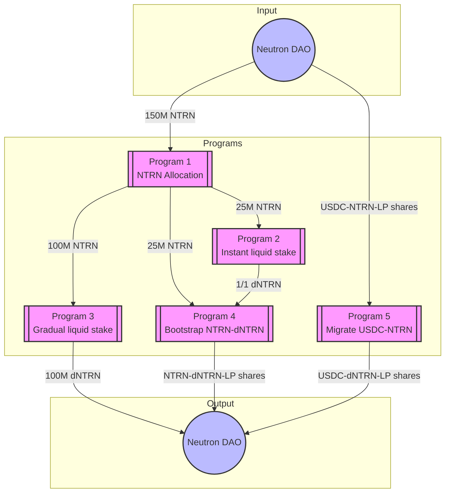

# Neutron dICS Programs

There are five programs Timewave is deploying to support Neutron's monetary policy as they become a sovereign Proof of Stake chain.
These include the following.

1. **NTRN Allocation Program**: This program receives 150M NTRN and allocates them to the other programs. See [program details](programs/2025-03-23-prod-dICS-ntrn-allocation/README.md).
2. **Instant liquid-stake NTRN Program**: This program receives 25M NTRN which is liquid staked using the Drop protocol immediately. All dNTRN is sent to bootstrap NTRN and dNTRN liquidity, i.e., program 4. See [program details](programs/2025-03-23-prod-dICS-ntrn-instant-ls/README.md).
3. **Gradual liquid-stake NTRN program**: This program receives 100M NTRN and it liquid stakes these gradually over three months. See [program details](programs/2025-03-23-prod-dICS-gradual-ls/README.md).
4. **Bootstrap NTRN and dNTRN liquidity program**: This program receives NTRN from program 1 and dNTRN from program 2. It provides liquidity to the Astroport pool and returns the LP share tokens to the Neutron DAO. See [program details](programs/2025-03-23-prod-bootstrap-ntrn-dntrn-liquidity/README.md).
5. **Migrate USDC-NTRN liquidity program**: This program receives the USDC-NTRN liquidity LP tokens from the Neutron DAO. It withdraws the liquidity, liquid stakes the NTRN, and enters the USDC-dNTRN liquidity pool. Liquidity tokens are sent back to the Neutron DAO. See [program details](programs/2025-03-23-prod-migrate-usdc-ntrn-liquidity/README.md).



## Security Model

Each program implements a two-tier security model:

1. **Low Security Operations**
   - Authorized by addresses in the `operator_list`
   - Includes routine operations like:
     - Splitting NTRN
     - Liquid staking NTRN
     - Providing liquidity
     - Withdrawing liquidity
   - No call limits on authorized functions

2. **High Security Operations**
   - Requires authorization from either the Neutron DAO or the Security DAO
   - Includes critical operations like:
     - Updating program configurations
     - Returning unspent tokens
     - Modifying security parameters
   - No call limits on authorized functions

Each program maintains its own set of authorized operators and security parameters, but follows this consistent security model across all programs in the dICS initiative.

## Program Deployment Order

Due to dependencies in the programs, programs should be deployed in reverse order. The `program_param` TOML files will need to be updated with addresses from the programs.
- Program 5 is independent of programs 1-4
- Program 2 needs the receiver address for Program 4
- Program 1 needs receiver addresses for Programs 1, 2, and 3

## Testing and Rehearsals

For detailed information about each program's configuration parameters, subroutines, and security model, please refer to the individual program READMEs linked above.

Programs have been deployed in the following environments:
<details>
<summary>Mainnet Fork Deployment</summary>

#### Mainnet fork deployment
1. Deployed. Program ID 12
  - Receiver address is `neutron1u3fsk7ycfmp8dpxdtxyrc8lgpqjk0w5xc82vqn9hdxnrru8jt3ssj7majv`
2. Deployed. Program ID 11
 - Receiver address is `neutron1yr6xedwtmfvqrjspzp2ra5r63jcamt8ezg9ze9pd5s8g4ms5srhsr9rdat`
3. Deployed. Program ID 10
  - Receiver address is 
  `neutron1x5nwwtk7cez7lt7w6l7uv0shhkk3kz3flgjhlwc2d0cjjx23gsxqn54wf2`
4. Deployed. Program ID 8
  - Receiver address for dNTRN and NTRN `neutron10994ns22tn2gqur47d5z0pfv4l623t7u7fe6yjv7qf4g53vw047srln2kd`
5. Deployed. Program ID 7
  - Receiver address for USDC-NTRN-LP shares `neutron12eawpnrularsa84fr5yz6jj4w9tq2jj23fck7ye7m0vxkl9elu4qy7rshm`

</details>

<details>
<summary> Testnet (pion-1) Deployment</summary>

#### Pion-1 deployment

Values different from mainnet fork deployment:
- DAO address: `neutron1kvxlf27r0h7mzjqgdydqdf76dtlyvwz6u9q8tysfae53ajv8urtq4fdkvy`
- USDC token: `factory/neutron19glux3jzdfyyz6ylmuksgxfj5phdaxfr2uhy86/usdc`
- dNTRN token: `factory/neutron1ytalpjvxz7njekfep97sss2s83ezw6q8lt9spsvnd2d43ygys9gssy7ept/udntrn`
- Drop core addresses: `neutron1wu9ng2pphg4g0a9d7ptq9ufqpcc7glhay33nhj79z4xs97qstj4q6un25a`
- USDC-NTRN pool (testnet): `neutron16puus9vjwq4xq0pkl59x30qwn5t48t7r90zqcgc5g8qsyu0u0fnskraxld`
  ASSET1: uusdc, ASSET2: untrn
  AMOUNTS: 4762380976 uusdc, 105000000 uuntrn
- USDC-dNTRN pool: `neutron1faz0e5wugx23c03pa85alslvhyge8xk9hxwlyltjhn7zttng4n2qqpjl4m`
  ASSET1: dNTRN, ASSET2: uusdc
  AMOUNTS: 5000000 dNTRN, 226750000 uusdc
- dNTRN-NTRN pool: `neutron1y80nv0gw08q37vltcx9kh2zmh0c4m45u7ts8t4tm0axtvv7jllhsasc0en`
  ASSET1: dNTRN, ASSET2: untrn
  AMOUNTS: 500000000 udntrn, 500000000 untrn

Values:
Valence recieves 50M NTRN:
* 30M NTRN to be staked immediately [Valence];
* 10M NTRN staked over time [Valence];
* 10M NTRN + 10M dNTRN pool bootstrap;

Testnet pion-1 deployment checklist
1. Deployed. Program ID 5
  - Receiver address is `neutron137kcd226g24frg3pczal4ux72k6lrk5pnfl482zceceyyldzjmqsrmgsrv`
2. Deployed. Program ID 4
 - Receiver address is `neutron1pdkwssx28zp93p4pucfgy05dvrvcsttpktgphrwxqvlxw3chxcksuuejr8`
3. Deployed. Program ID 2
  - Receiver address is 
  `neutron1lr8pdcr3kgvljjt689a36a0pf6u92r223dy9nk84ks8fpkjw5fhqvfxep6`
4. Deployed. Program ID 3
  - Receiver address for dNTRN and NTRN `neutron1wwyrj5nh8z4jvc36yugpy9f7sdx3d694faknkln673sf4xcs4apsvmwmz0`
5. Deployed. Program ID 1
  - Receiver address for USDC-NTRN-LP shares `neutron1qaaf9lv99pwyeaf7ktw37wetyzpper28j6cltqgw600g3gtsac4s64wtx2`
</details>

## Subroutine Authorization Matrix

| Program | Subroutine | Authorization | Parameter Restrictions | Test Status |
|---------|------------|---------------|------------------------|-------------|
| **Program 1: NTRN Allocation** |
| | `split_ntrn` | Operators | Must include "process_function" and "liquid_stake" parameters | |
| | `update_split_config` | Neutron DAO only | Must include "update_config" and "new_config" parameters | |
| **Program 2: Instant Liquid Stake** |
| | `liquid_stake` | Operators | Must include "process_function" and "liquid_stake" parameters | |
| | `split_to_provide` | Operators | Must include "process_function" and "split" parameters | |
| | `secure_update_split_config` | Neutron DAO only | Must include "update_config" and "new_config" parameters | |
| **Program 3: Gradual Liquid Stake** |
| | `liquid_stake_batch` | Operators | Must include "process_function" and "liquid_stake" parameters | |
| | `forward_batch` | Operators | Must include "process_function" and "forward" parameters | |
| | `secure_update_forwarder_config` | Neutron DAO + Security DAO | Must include "update_config" and "new_config" parameters | |
| **Program 4: Bootstrap NTRN-dNTRN** |
| | `secure_send_tokens_to_dao` | Neutron DAO + Security DAO | Controlled by forwarder config parameters | |
| | `double_sided_lp` | Operators | Pool ratio must be between constrained `expected_pool_ratio_min` and `expected_pool_ratio_max` | |
| | `secure_double_sided_lp` | Security DAO | Can set the `expected_pool_ratio_min` and `expected_pool_ratio_max` while providing liquidity | |
| | `secure_single_sided_lp` | Security DAO | Can set the `expected_pool_ratio_min` and `expected_pool_ratio_max` and `max_spread` | |
| | `secure_update_return_forwarder_config` | Neutron DAO + Security DAO | Must include "update_config" and "new_config" parameters | |
| **Program 5: Migrate USDC-NTRN** |
| | `forward_usdc_ntrn_lp_batch` | Operators | Must include "process_function" and "forward" parameters | |
| | `withdraw_usdc_ntrn_liquidity` | Operators | Must include "process_function" and "withdraw_liquidity" parameters | |
| | `forward_usdc_to_provide_ready_account` | Operators | Must include "process_function" and "forward" parameters | |
| | `liquid_stake_ntrn` | Operators | Must include "process_function" and "liquid_stake" parameters | |
| | `provide_double_sided_liquidity` | Operators | Pool ratio must be between `expected_pool_ratio_min` and `expected_pool_ratio_max` | |
| | `secure_provide_double_sided_liquidity` | Neutron DAO + Security DAO | Can set the expected pool ration with `expected_pool_ratio_min` and `expected_pool_ratio_max` | |
| | `secure_provide_single_sided_liquidity` | Neutron DAO + Security DAO | Must specify which asset to provide | |
| | `secure_return_unspent_tokens` | Neutron DAO + Security DAO | Must include "process_function" and "forward" parameters | |
| | `secure_update_lp_forward_config` | Neutron DAO + Security DAO | Must include "update_config" and "new_config" parameters | |
| | `secure_update_usdc_forwarder_config` | Neutron DAO + Security DAO | Must include "update_config" and "new_config" parameters | |

## Mainnet Parameters

Each program requires specific parameters for deployment. The following tables list the required parameters for each program.

### Program 1: NTRN Allocation
| Parameter | Description | Value |
|-----------|-------------|--------|
| `owner` | Program owner address | `neutron1suhgf5svhu4usrurvxzlgn54ksxmn8gljarjtxqnapv8kjnp4nrstdxvff` |
| `ntrn_denom` | NTRN token denomination | "untrn" |
| `vp2_instant_ls_receiver_address` | Address to receive NTRN for instant liquid stake | TODO Program 2's receiver address |
| `vp2_instant_ls_amount` | Amount of NTRN for instant liquid stake | "25000000000000" (25M NTRN) |
| `vp3_gradual_ls_receiver_address` | Address to receive NTRN for gradual liquid stake | TODO Program 3's receiver address |
| `vp3_gradual_ls_amount` | Amount of NTRN for gradual liquid stake | "100000000000000" (100M NTRN) |
| `vp4_bootstrap_liquidity_receiver_address` | Address to receive NTRN for bootstrap liquidity | TODO Program 4's receiver address |
| `vp4_bootstrap_liquidity_amount` | Amount of NTRN for bootstrap liquidity | "25000000000000" (25M NTRN) |
| `neutron_dao_addr` | Neutron DAO address | `neutron1suhgf5svhu4usrurvxzlgn54ksxmn8gljarjtxqnapv8kjnp4nrstdxvff` |
| `operator_list` | List of addresses authorized for low-security operations | `["neutron1qxatg2nkmsf26cymcg2saeh9l2cqp0s2xms7xd", "neutron1ze09kc5ackut7wc4pf38lysu45kfz3msr98nru", "neutron1h8vf3ueml7ah7m8z9e6vx09trq5lv2fw9e049f", "neutron1tf0uhd8hs7tqxw2pdrlvzenkugkyfa2jh82ndu", "neutron14mlpd48k5vkeset4x7f78myz3m47jcax3ysjkp", "neutron1v45lnmf3h3ujdh4pyegpt24y60nsh758q2yna7"]` |

### Program 2: Instant Liquid Stake
| Parameter | Description | Value |
|-----------|-------------|--------|
| `owner` | Program owner address | `neutron1suhgf5svhu4usrurvxzlgn54ksxmn8gljarjtxqnapv8kjnp4nrstdxvff` |
| `ntrn_denom` | NTRN token denomination | "untrn" |
| `dntrn_denom` | dNTRN token denomination | `factory/neutron1frc0p5czd9uaaymdkug2njz7dc7j65jxukp9apmt9260a8egujkspms2t2/udntrn` |
| `neutron_dao_addr` | Neutron DAO address | `neutron1suhgf5svhu4usrurvxzlgn54ksxmn8gljarjtxqnapv8kjnp4nrstdxvff` |
| `vp4_bootstrap_liquidity_receiver_addr` | Address to receive dNTRN for bootstrap liquidity | TODO Program 4's receiver address |
| `drop_liquid_staker_addr` | Drop protocol contract address | `neutron1lsxvdyvmexak084wdty2yvsq5gj3wt7wm4jaw34yseat7r4qjffqlxlcua` |
| `vp4_receiver_split_normalized_fraction` | Fraction of dNTRN to send to Program 4 | "1" |
| `operator_list` | List of addresses authorized for low-security operations | `["neutron1qxatg2nkmsf26cymcg2saeh9l2cqp0s2xms7xd", "neutron1ze09kc5ackut7wc4pf38lysu45kfz3msr98nru", "neutron1h8vf3ueml7ah7m8z9e6vx09trq5lv2fw9e049f", "neutron1tf0uhd8hs7tqxw2pdrlvzenkugkyfa2jh82ndu", "neutron14mlpd48k5vkeset4x7f78myz3m47jcax3ysjkp", "neutron1v45lnmf3h3ujdh4pyegpt24y60nsh758q2yna7"]` |

### Program 3: Gradual Liquid Stake
| Parameter | Description | Value |
|-----------|-------------|--------|
| `owner` | Program owner address | `neutron1suhgf5svhu4usrurvxzlgn54ksxmn8gljarjtxqnapv8kjnp4nrstdxvff` |
| `ntrn_denom` | NTRN token denomination | "untrn" |
| `drop_liquid_staker_addr` | Drop protocol contract address | `neutron1lsxvdyvmexak084wdty2yvsq5gj3wt7wm4jaw34yseat7r4qjffqlxlcua` |
| `max_amount_to_forward` | Maximum amount to forward in each batch | "6500000000000" (6.5M NTRN) |
| `interval_seconds_between_batches` | Time between batches. Use 1 week | "604800" |
| `neutron_dao_addr` | Neutron DAO address | `neutron1suhgf5svhu4usrurvxzlgn54ksxmn8gljarjtxqnapv8kjnp4nrstdxvff` |
| `security_dao_addr` | Security DAO address | `neutron1xc95vsacskqcqtyzmwfr5h7qaz60h0z3ksnz65l2ah4s85tyqrns7dyqmy` |
| `operator_list` | List of addresses authorized for low-security operations | `["neutron1qxatg2nkmsf26cymcg2saeh9l2cqp0s2xms7xd", "neutron1ze09kc5ackut7wc4pf38lysu45kfz3msr98nru", "neutron1h8vf3ueml7ah7m8z9e6vx09trq5lv2fw9e049f", "neutron1tf0uhd8hs7tqxw2pdrlvzenkugkyfa2jh82ndu", "neutron14mlpd48k5vkeset4x7f78myz3m47jcax3ysjkp", "neutron1v45lnmf3h3ujdh4pyegpt24y60nsh758q2yna7"]` |

### Program 4: Bootstrap NTRN-dNTRN
| Parameter | Description | Value |
|-----------|-------------|--------|
| `owner` | Program owner address | `neutron1suhgf5svhu4usrurvxzlgn54ksxmn8gljarjtxqnapv8kjnp4nrstdxvff` |
| `ntrn_denom` | NTRN token denomination | "untrn" |
| `dntrn_denom` | dNTRN token denomination | `factory/neutron1frc0p5czd9uaaymdkug2njz7dc7j65jxukp9apmt9260a8egujkspms2t2/udntrn` |
| `astroport_pool_addr` | Astroport pool address | `neutron1pd9u7h4vf36vtj5lqlcp4376xf4wktdnhmzqtn8958wyh0nzwsmsavc2dz` |
| `expected_pool_ratio_min` | Minimum pool ratio for liquidity provision | "0.98" |
| `expected_pool_ratio_max` | Maximum pool ratio for liquidity provision | "1.02" |
| `pool_max_spread` | Maximum acceptable spread when swapping | "0.02" |
| `ntrn_forwarder_amount` | Maximum NTRN amount to forward | "100000000000000" |
| `dntrn_forwarder_amount` | Maximum dNTRN amount to forward | "100000000000000" |
| `forwarder_interval_between_calls` | Time between forward operations | "1" |
| `neutron_dao_addr` | Neutron DAO address | `neutron1suhgf5svhu4usrurvxzlgn54ksxmn8gljarjtxqnapv8kjnp4nrstdxvff` |
| `security_dao_addr` | Security DAO address | `neutron1xc95vsacskqcqtyzmwfr5h7qaz60h0z3ksnz65l2ah4s85tyqrns7dyqmy` |
| `operator_list` | List of addresses authorized for low-security operations | `["neutron1qxatg2nkmsf26cymcg2saeh9l2cqp0s2xms7xd", "neutron1ze09kc5ackut7wc4pf38lysu45kfz3msr98nru", "neutron1h8vf3ueml7ah7m8z9e6vx09trq5lv2fw9e049f", "neutron1tf0uhd8hs7tqxw2pdrlvzenkugkyfa2jh82ndu", "neutron14mlpd48k5vkeset4x7f78myz3m47jcax3ysjkp", "neutron1v45lnmf3h3ujdh4pyegpt24y60nsh758q2yna7"]` |

### Program 5: Migrate USDC-NTRN
| Parameter | Description | Value |
|-----------|-------------|--------|
| `owner` | Program owner address | `neutron1suhgf5svhu4usrurvxzlgn54ksxmn8gljarjtxqnapv8kjnp4nrstdxvff` |
| `ntrn_denom` | NTRN token denomination | "untrn" |
| `dntrn_denom` | dNTRN token denomination | `factory/neutron1frc0p5czd9uaaymdkug2njz7dc7j65jxukp9apmt9260a8egujkspms2t2/udntrn` |
| `usdc_denom` | USDC token denomination | `ibc/B559A80D62249C8AA07A380E2A2BEA6E5CA9A6F079C912C3A9E9B494105E4F81` |
| `usdc_ntrn_lp_denom` | USDC-NTRN LP token denomination | `factory/neutron18c8qejysp4hgcfuxdpj4wf29mevzwllz5yh8uayjxamwtrs0n9fshq9vtv/astroport/share` |
| `usdc_ntrn_lp_max_batch_size` | Maximum LP tokens to process in each batch (Total received is `2821604380571`) | `564320876115` per batch |
| `usdc_ntrn_lp_batch_interval_seconds` | Time between processing batches | `86400` |
| `usdc_ntrn_pool_addr` | USDC-NTRN pool address | `neutron18c8qejysp4hgcfuxdpj4wf29mevzwllz5yh8uayjxamwtrs0n9fshq9vtv` |
| `drop_liquid_staker_addr` | Drop protocol contract address | `neutron1lsxvdyvmexak084wdty2yvsq5gj3wt7wm4jaw34yseat7r4qjffqlxlcua` |
| `usdc_dntrn_pool_addr` | USDC-dNTRN pool address | `neutron1hme8vcsky2xeq4qc4wg3uy9gc47xzga6uqk8plaps8tvutjshuwqajnze6` |
| `expected_pool_ratio_min` | Minimum pool ratio for liquidity provision | `0.115`|
| `expected_pool_ratio_max` | Maximum pool ratio for liquidity provision | `0.145`|
| `pool_max_spread` | Maximum acceptable spread when swapping | `0.10` |
| `neutron_dao_addr` | Neutron DAO address | `neutron1suhgf5svhu4usrurvxzlgn54ksxmn8gljarjtxqnapv8kjnp4nrstdxvff` |
| `security_dao_addr` | Security DAO address | `neutron1xc95vsacskqcqtyzmwfr5h7qaz60h0z3ksnz65l2ah4s85tyqrns7dyqmy` |
| `operator_list` | List of addresses authorized for low-security operations | `["neutron1qxatg2nkmsf26cymcg2saeh9l2cqp0s2xms7xd", "neutron1ze09kc5ackut7wc4pf38lysu45kfz3msr98nru", "neutron1h8vf3ueml7ah7m8z9e6vx09trq5lv2fw9e049f", "neutron1tf0uhd8hs7tqxw2pdrlvzenkugkyfa2jh82ndu", "neutron14mlpd48k5vkeset4x7f78myz3m47jcax3ysjkp", "neutron1v45lnmf3h3ujdh4pyegpt24y60nsh758q2yna7"]` |
| `usdc_forwarder_max_amount` | Maximum USDC amount to forward | `100000000000000` |
| `return_forwarder_max_amount` | Maximum amount to return | `100000000000000` |

### Code IDs used

valence_astroport_lper:
  code_id: '3297'
  hash: 6881cf68070e98053882b1e5ac3f6d39be77eb9acf26a526d3cee13399c4386d
  source: 85ecf4974c62bcb6443ac16b9dd7d178eed07841
valence_astroport_withdrawer:
  code_id: '3298'
  hash: c9678657c18bc58543faa0bb82942a6f3b7dd902e6a6439a5e0ceb696c3e69c3
  source: 85ecf4974c62bcb6443ac16b9dd7d178eed07841
valence_authorization:
  code_id: '3299'
  hash: aae7c5b4058d6027146860097a29e07b8c36a833dbf56a7425748b16efa22aab
  source: 85ecf4974c62bcb6443ac16b9dd7d178eed07841
valence_base_account:
  code_id: '3300'
  hash: cfa668dee6d785928d9f9097c1091a0aabb260f74a3fd723893ab0d3862513c6
  source: 85ecf4974c62bcb6443ac16b9dd7d178eed07841
valence_forwarder_library:
  code_id: '3301'
  hash: 74f86ed59b7d274a407404b87af985a24c5909162e3d9e0969ac73367bae671f
  source: 85ecf4974c62bcb6443ac16b9dd7d178eed07841
valence_processor:
  code_id: '3302'
  hash: 634de9a2c0a05baec9894991ca0d1333a3a7e67086d402421edfb6632c869791
  source: 85ecf4974c62bcb6443ac16b9dd7d178eed07841
valence_program_registry:
  code_id: '3303'
  hash: 82d8593dede5c67db801ad19f213ab049a14e4efc29dfa09bcad729453e80741
  source: 85ecf4974c62bcb6443ac16b9dd7d178eed07841
valence_reverse_splitter_library:
  code_id: '3304'
  hash: 6b7949414f114ca64f441bce70223ab9890b665fa18390c88f600fb224313881
  source: 85ecf4974c62bcb6443ac16b9dd7d178eed07841
valence_splitter_library:
  code_id: '3305'
  hash: 0e414e92b46131d69133a8134927223240ffaffa4499517c40697c56a57e0de9
  source: 85ecf4974c62bcb6443ac16b9dd7d178eed07841
valence_generic_ibc_transfer_library:
  code_id: '3306'
  hash: 4ec97203fadaac7eb338bbbad91b004d8a1860d2306ec572dd6147cb2dd7cd77
  source: 85ecf4974c62bcb6443ac16b9dd7d178eed07841
valence_neutron_ibc_transfer_library:
  code_id: '3307'
  hash: e3324cb9c01727866a53afe1ad690dd7e32905af70251a0c3f6726d8bd29eb15
  source: 85ecf4974c62bcb6443ac16b9dd7d178eed07841
valence_drop_liquid_staker:
  code_id: '3310'
  hash: 0effb769091ad197f2ec3dd6292f962b5d52f17af8e371087f673543aa5713e0
  source: e24c96566714c6d047f9e8f1e15527dca88314c0
valence_drop_liquid_unstaker:
  code_id: '3311'
  hash: 2b2c3365b51f7d9a0b4d5c2e58733196ca18228386dc292eae70d88e5968048a
  source: e24c96566714c6d047f9e8f1e15527dca88314c0

<details>
<summary>Mainnet Deployment</summary>

#### Mainnet deployment
1. Deployed. Program ID 
  - Receiver address is `neutron1u3fsk7ycfmp8dpxdtxyrc8lgpqjk0w5xc82vqn9hdxnrru8jt3ssj7majv`
2. Deployed. Program ID 
 - Receiver address is `neutron1yr6xedwtmfvqrjspzp2ra5r63jcamt8ezg9ze9pd5s8g4ms5srhsr9rdat`
3. Deployed. Program ID 
  - Receiver address is 
  `neutron1x5nwwtk7cez7lt7w6l7uv0shhkk3kz3flgjhlwc2d0cjjx23gsxqn54wf2`
4. Deployed. Program ID 
  - Receiver address for dNTRN and NTRN `neutron10994ns22tn2gqur47d5z0pfv4l623t7u7fe6yjv7qf4g53vw047srln2kd`
5. Deployed. Program ID 102
  - Receiver address for USDC-NTRN-LP shares `neutron1d58c25fw3hwpjvg9dzgr2m235qpgtsc7stjt7u08kqg8jd583fgsyr5ytg`

</details>

## Useful commands

### Querying pools

To query pool information:

```bash
neutrond q wasm contract-state smart <POOL_ADDRESS> '{"pool":{}}' --chain-id neutron-1 --node https://neutron-rpc.polkachu.com:443 --output json | jq
```

This will return an array of assets. The pool ratio is defined by amount of the first asset divided by the amount of the second asset.
