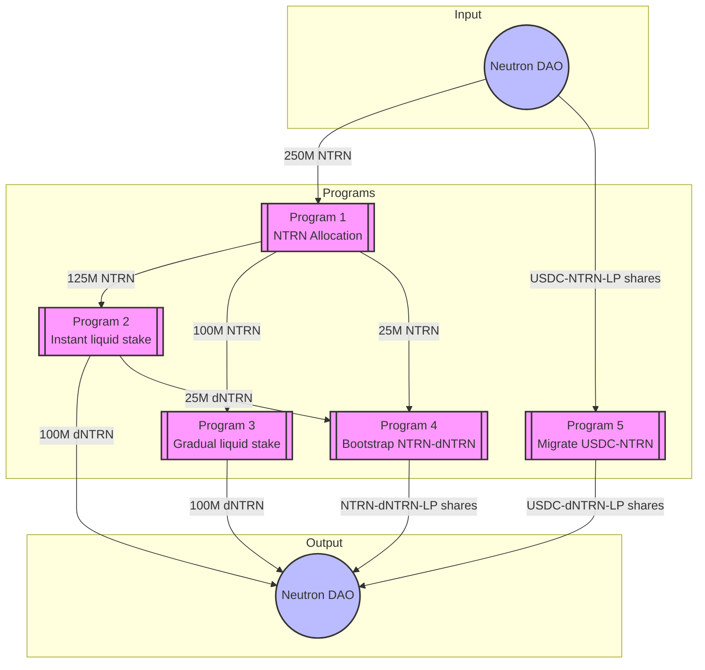

# Neutron dICS Programs

There are five programs Timewave is deploying to support Neutron's monetary policy as they become a sovereign Proof of Stake chain.
These include the following.

1. **NTRN Allocation Program**: This program receives 250M NTRN and allocates them to the other programs. See [program details](programs/2025-03-23-prod-dICS-ntrn-allocation/README.md).
2. **Instant liquid-stake NTRN Program**: This program receives 125M NTRN which is liquid staked using the Drop protocol immediately. 100M dNTRN is returned to the DAO. 25M dNTRN is sent to bootstrap NTRN and dNTRN liquidity, i.e., program 4. See [program details](programs/2025-03-23-prod-dICS-ntrn-instant-ls/README.md).
3. **Gradual liquid-stake NTRN program**: This program receives 100M NTRN and it liquid stakes these gradually over three months. See [program details](programs/2025-03-23-prod-dICS-gradual-ls/README.md).
4. **Bootstrap NTRN and dNTRN liquidity program**: This program receives NTRN from program 1 and dNTRN from program 2. It provides liquidity to the Astroport pool and returns the LP share tokens to the Neutron DAO.
5. **Migrate USDC-NTRN liquidity program**: This program receives the USDC-NTRN liquidity LP tokens from the Neutron DAO. It withdraws the liquidity, liquid stakes the NTRN, and enters the USDC-dNTRN liquidity pool. Liquidity tokens are sent back to the Neutron DAO. See [program details](programs/2025-03-23-prod-migrate-usdc-ntrn-liquidity/README.md).

