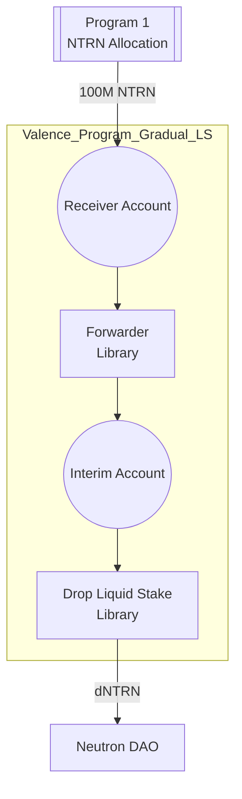

# Gradual Liquid-Stake NTRN Program (v1)

Please see Neutron [dICS Programs](../../Neutron_dICS_Programs.md) for background. This program is dICS Program 3.

This directory provides support for building and deploying a program that performs gradual liquid staking of NTRN tokens as part of Neutron's dICS initiative:
- The program receives 100M NTRN from Program 1
- The program uses the Drop protocol to gradually liquid stake the NTRN over three months
- The program returns all resulting dNTRN to the Neutron DAO

## Program structure

## Configuration Parameters

The program accepts the following configuration parameters:

- `owner`: The owner address of the program
- `ntrn_denom`: The denomination of NTRN tokens (e.g., "untrn")
- `dntrn_denom`: The denomination of dNTRN tokens
- `neutron_dao_addr`: Address to receive dNTRN tokens
- `drop_liquid_staker_addr`: Address of the Drop protocol core contract
- `security_dao_addr`: Address of the Security DAO
- `operator_list`: Array of addresses authorized for low-security operations
- `interval_seconds_between_batches`: Duration between batches (in seconds)
- `max_amount_to_forward`: Amount of NTRN to forward in each batch

## Subroutines

The program includes the following subroutines:

1. `liquid_stake_batch`
   - Purpose: Performs liquid staking of a batch of NTRN using Drop protocol
   - Authorization: Operators in the operator_list
   - Function: Calls the liquid stake library's process_function
   - Message Restrictions: Must include "process_function" and "liquid_stake" parameters

2. `forward_batch`
   - Purpose: Transfers a batch of NTRN tokens from the receiver account to the interim account from where they will be liquid staked
   - Authorization: Operators in the operator_list
   - Function: Calls the forwarder library's process_function
   - Message Restrictions: Must include "process_function" and "forward" parameters

3. `secure_update_forwarder_config`
   - Purpose: Updates the program configuration
   - Authorization: Neutron DAO and Security DAO only
   - Function: Updates critical program parameters
   - Message Restrictions: Must include "update_config" and "new_config" parameters

## Security Model

The program implements a two-tier security model:

1. Low Security Operations
   - Authorized by addresses in the operator_list
   - Includes routine operations like liquid staking NTRN and transferring tokens
   - No call limits on authorized functions

2. High Security Operations
   - Requires authorization from either Neutron DAO or Security DAO
   - Includes critical operations like updating program configuration
   - No call limits on authorized functions

## Directory structure

This is a single program builder with the following structure:

- `output/` - Output directory for deployed program
- `src/` - Program source code
    - `main.rs` - Entry point to the script
    - `program_builder.rs` - Program builder code that defines the program configuration
- `program_params/` - Program parameters for different environments
    - `mainnet.toml` - Production configuration

## Version History

- v1: Initial production version with gradual liquid staking functionality
