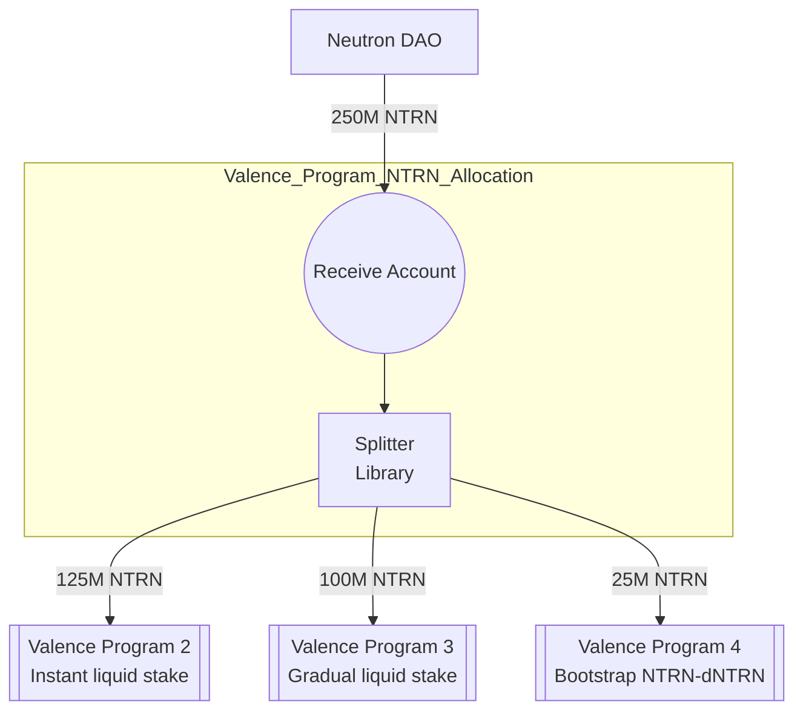

# NTRN Allocation Program (v1)

Please see Neutron [dICS Programs](../../Neutron_dICS_Programs.md) for background. This program is dICS Program 1.

This directory provides support for building and deploying a program that allocates NTRN to other programs as part of Neutron's dICS initiative:
- The program instantiates a single Valence Account that receives 250M NTRN
- The program instantiates a single splitter that splits received NTRN per the following configuration:
    - 125M NTRN is allocated to dICS program 2
    - 100M NTRN is allocated to dICS program 3
    - 25M NTRN is allocated to dICS program 4

## Program structure

## Configuration Parameters

The program accepts the following configuration parameters:

- `owner`: The owner address of the program
- `ntrn_denom`: The denomination of NTRN tokens (e.g., "untrn")
- `vp2_instant_ls_receiver_address`: Address to receive NTRN for instant liquid stake
- `vp2_instant_ls_amount`: Amount of NTRN for instant liquid stake
- `vp3_gradual_ls_receiver_address`: Address to receive NTRN for gradual liquid stake
- `vp3_gradual_ls_amount`: Amount of NTRN for gradual liquid stake
- `vp4_bootstrap_liquidity_receiver_address`: Address to receive NTRN for bootstrap liquidity
- `vp4_bootstrap_liquidity_amount`: Amount of NTRN for bootstrap liquidity
- `neutron_dao_addr`: Address of the Neutron DAO
- `security_dao_addr`: Address of the Security DAO
- `operator_list`: List of addresses authorized for low-security operations

## Subroutines

The program includes the following subroutines:

1. `split_ntrn`
   - Purpose: Splits received NTRN tokens according to the configured allocation
   - Authorization: Operators in the operator_list
   - Function: Calls the splitter library's process_function

2. `update_split_config`
   - Purpose: Updates the split configuration for NTRN allocation
   - Authorization: Neutron DAO and Security DAO only
   - Function: Calls the splitter library's update_config

## Security Model

The program implements a two-tier security model:

1. Low Security Operations
   - Authorized by addresses in the operator_list
   - Includes routine operations like splitting NTRN

2. High Security Operations
   - Requires authorization from either Neutron DAO or Security DAO
   - Includes critical operations like updating split configuration

## Directory structure

This is a single program builder with the following structure:

- `output/` - Output directory for deployed program
- `src/` - Program source code
    - `main.rs` - Entry point to the script
    - `program_builder.rs` - Program builder code that defines the program configuration
- `program_params/` - Program parameters for different environments
    - `mainnet.toml` - Production configuration

## Version History

- v1: Initial production version with basic allocation functionality