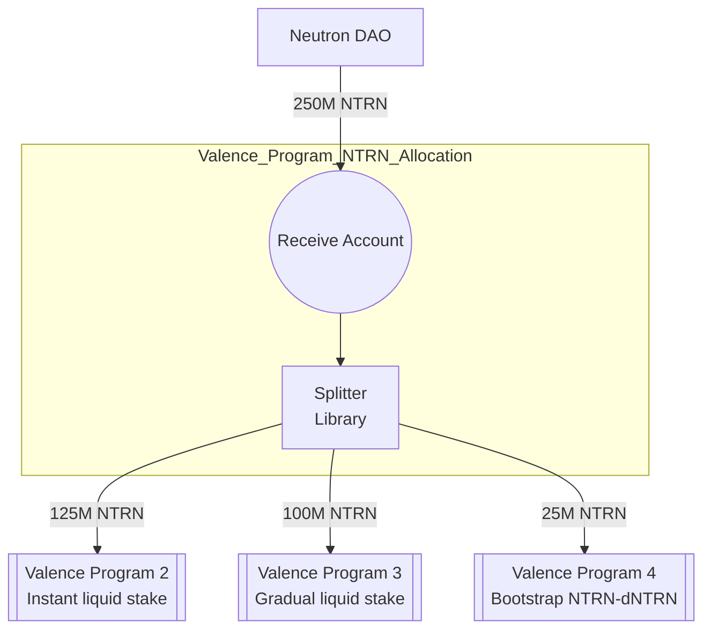

# NTRN Allocation Program (v1)

Please see Neutron [dICS Programs](../../Neutron_dICS_Programs.md) for background. This program is dICS Program 1.

This directory provides support for building and deploying a program that allocates NTRN to other programs as part of Neutron's dICS initiative:
- The program instantiates a single Valence Account that receives 250M NTRN
- The program instantiates a single splitter that splits received NTRN per the following configuration:
    - 125M NTRN is allocated to dICS program 2
    - 100M NTRN is allocated to dICS program 3
    - 25M NTRN is allocated to dICS program 4

## Program structure

## Configuration Parameters
TODO

## Subroutines
TODO

## Directory structure

This is a single program builder with the following structure:

- `output/` - Output directory for deployed program
- `src/` - Program source code
    - `main.rs` - Entry point to the script
    - `program_builder.rs` - Program builder code that defines the program configuration
- `program_params/` - Program parameters for different environments
    - `mainnet.toml` - Production configuration

## Version History

- v1: Initial production version with basic allocation functionality