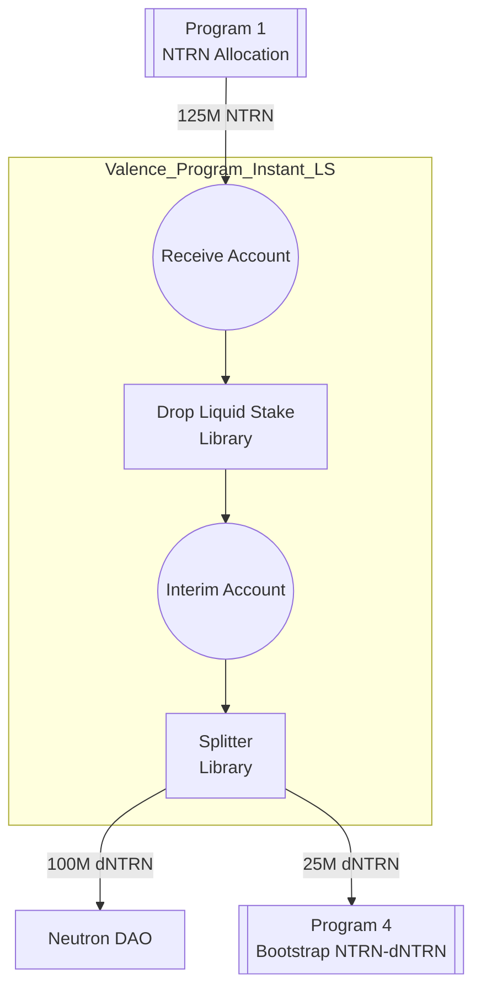

# Instant Liquid Stake NTRN Program (v1)

Please see Neutron [dICS Programs](../../Neutron_dICS_Programs.md) for background. This program is dICS Program 2.

This directory provides support for building and deploying a program that performs instant liquid staking of NTRN tokens as part of Neutron's dICS initiative:
- The program receives 125M NTRN from Program 1
- The program uses the Drop protocol to instantly liquid stake the NTRN
- The program uses a splitter to distribute the resulting dNTRN per the following configuration:
    - 100M dNTRN is returned to the Neutron DAO
    - 25M dNTRN is sent to Program 4 for bootstrap liquidity
- The split is performed using a ratio (0.8:0.2) rather than with fixed amounts

## Program structure

## Configuration Parameters

The program accepts the following configuration parameters:

- `owner`: The owner address of the program
- `ntrn_denom`: The denomination of NTRN tokens (e.g., "untrn")
- `dntrn_denom`: The denomination of dNTRN tokens
- `neutron_dao_addr`: Address to receive 100M dNTRN
- `vp4_bootstrap_liquidity_receiver_addr`: Address to receive 25M dNTRN
- `drop_liquid_staker_addr`: Address of the Drop protocol contract
- `security_dao_addr`: Address of the Security DAO
- `operator_list`: Array of addresses authorized for low-security operations
- `ntrn_dao_split_normalized_fraction`: String representation of the percentage of liquid staked assets to be sent to Neutron DAO (e.g., "0.8" = 80%)
- `vp4_receiver_split_normalized_fraction`: String representation of the percentage of liquid staked assets to be sent to Program 4 (e.g., "0.2" = 20%)

## Subroutines

The program includes the following subroutines:

1. `liquid_stake`
   - Purpose: Performs instant liquid staking of NTRN using Drop protocol
   - Authorization: Operators in the operator_list
   - Function: Calls the liquid stake library's process_function
   - Message Restrictions: Must include "process_function" and "liquid_stake" parameters

2. `split_to_provide`
   - Purpose: Splits liquid staked tokens to recipients
   - Authorization: Operators in the operator_list
   - Function: Calls the splitter library's process_function
   - Message Restrictions: Must include "process_function" and "split" parameters

3. `secure_update_split_config`
   - Purpose: Updates the splitter configuration
   - Authorization: Neutron DAO and Security DAO only
   - Function: Updates critical program parameters
   - Message Restrictions: Must include "update_config" and "new_config" parameters

## Security Model

The program implements a two-tier security model:

1. Low Security Operations
   - Authorized by addresses in the operator_list
   - Includes routine operations like liquid staking NTRN and splitting tokens
   - No call limits on authorized functions

2. High Security Operations
   - Requires authorization from either Neutron DAO or Security DAO
   - Includes critical operations like updating program configuration
   - No call limits on authorized functions

## Directory structure

This is a single program builder with the following structure:

- `output/` - Output directory for deployed program
- `src/` - Program source code
    - `main.rs` - Entry point to the script
    - `program_builder.rs` - Program builder code that defines the program configuration
- `program_params/` - Program parameters for different environments
    - `mainnet.toml` - Production configuration

## Version History

- v1: Initial production version with instant liquid staking functionality 