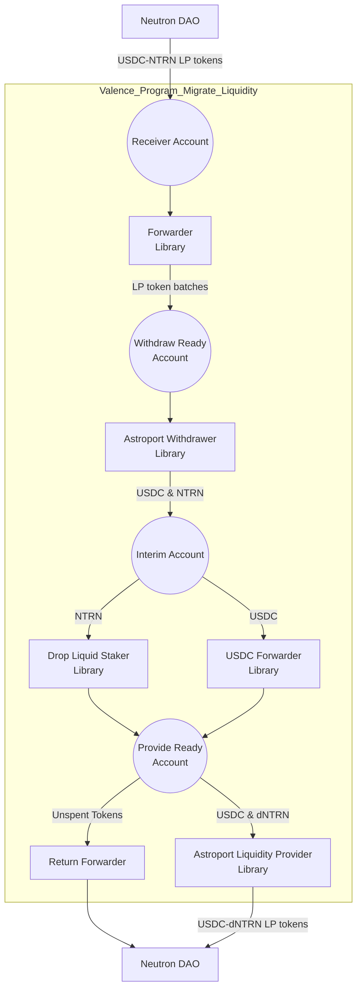

# Migrate USDC-NTRN Liquidity Program (v1)

Please see Neutron [dICS Programs](../../Neutron_dICS_Programs.md) for background. This program is dICS Program 5.

This directory provides support for building and deploying a program that migrates USDC-NTRN liquidity to USDC-dNTRN as part of Neutron's dICS initiative:
- The program receives USDC-NTRN LP tokens from the Neutron DAO
- The program batches the LP tokens and in batches withdraws the liquidity from the USDC-NTRN pool
- The program liquid stakes the NTRN portion using the Drop protocol
- The program provides liquidity to the USDC-dNTRN pool
- The program returns the new USDC-dNTRN LP tokens to the Neutron DAO

## Program structure

## Configuration Parameters

The program accepts the following configuration parameters:

- `owner`: The owner address of the program
- `ntrn_denom`: The denomination of NTRN tokens (e.g., "untrn")
- `dntrn_denom`: The denomination of dNTRN tokens
- `usdc_denom`: The denomination of USDC tokens
- `usdc_ntrn_lp_token_denom`: The denomination of the USDC-NTRN LP share tokens
- `usdc_dntrn_lp_tokens_denom`: The denomination of the USDC-dNTRN LP share tokens
- `neutron_dao_addr`: Address to receive USDC-dNTRN LP tokens
- `drop_liquid_staker_addr`: Address of the Drop protocol contract
- `astroport_usdc_ntrn_pool_addr`: Address of the Astroport USDC-NTRN pool contract
- `astroport_usdc_dntrn_pool_addr`: Address of the Astroport USDC-dNTRN pool contract
- `security_dao_addr`: Address of the Security DAO
- `operator_list`: Array of addresses authorized for low-security operations
- `usdc_ntrn_lp_max_batch_size`: Maximum amount of LP tokens to process in each batch
- `usdc_ntrn_lp_batch_interval_seconds`: Time between processing batches of LP tokens
- `double_sided_min`: Minimum pool ratio (AssetA/AssetB) for double-sided liquidity
- `double_sided_max`: Maximum pool ratio (AssetA/AssetB) for double-sided liquidity
- `pool_max_spread`: Maximum acceptable spread when swapping tokens
- `usdc_forwarder_max_amount`: Maximum amount of USDC to forward in a single call
- `return_forwarder_max_amount`: Maximum amount of tokens to return in a single call

## Subroutines

The program includes the following subroutines:

1. `forward_usdc_ntrn_lp_batch`
   - Purpose: Batches and forwards USDC-NTRN LP tokens
   - Authorization: Operators in the operator_list
   - Function: Calls the forwarder library's process_function
   - Message Restrictions: Must include "process_function" and "forward" parameters

2. `withdraw_usdc_ntrn_liquidity`
   - Purpose: Withdraws liquidity from the USDC-NTRN pool
   - Authorization: Operators in the operator_list
   - Function: Calls the withdraw library's process_function
   - Message Restrictions: Must include "process_function" and "withdraw_liquidity" parameters
   - Asset Order: USDC (asset1) and NTRN (asset2)

3. `forward_usdc_to_provide_ready_account`
   - Purpose: Forwards USDC tokens to the Provide Ready account
   - Authorization: Operators in the operator_list
   - Function: Calls the forwarder library's process_function
   - Message Restrictions: Must include "process_function" and "forward" parameters

4. `liquid_stake_ntrn`
   - Purpose: Liquid stakes the NTRN portion using Drop protocol
   - Authorization: Operators in the operator_list
   - Function: Calls the liquid stake library's process_function
   - Message Restrictions: Must include "process_function" and "liquid_stake" parameters

5. `provide_double_sided_liquidity`
   - Purpose: Provides liquidity to the USDC-dNTRN pool
   - Authorization: Operators in the operator_list
   - Function: Calls the liquidity provider library's process_function
   - Message Restrictions: Must include "process_function" and "provide_double_sided_liquidity" parameters
   - Asset Order: USDC (asset1) and dNTRN (asset2)
   - Additional Parameters: expected_pool_ratio_range (min and max pool ratios)

6. `secure_provide_double_sided_liquidity`
   - Purpose: Provides liquidity to the USDC-dNTRN pool in secure mode
   - Authorization: Neutron DAO and Security DAO only
   - Function: Calls the liquidity provider library's process_function
   - Message Restrictions: Must include "process_function" and "provide_double_sided_liquidity" parameters
   - Asset Order: USDC (asset1) and dNTRN (asset2)
   - Additional Parameters: expected_pool_ratio_range (min and max pool ratios)

7. `secure_provide_single_sided_liquidity`
   - Purpose: Provides single-sided liquidity to the USDC-dNTRN pool in secure mode
   - Authorization: Neutron DAO and Security DAO only
   - Function: Calls the liquidity provider library's process_function
   - Message Restrictions: Must include "process_function" and "provide_single_sided_liquidity" parameters
   - Additional Parameters: asset (specifies which asset to provide)

8. `secure_return_unspent_tokens`
   - Purpose: Returns unspent tokens to the Neutron DAO
   - Authorization: Neutron DAO and Security DAO only
   - Function: Calls the return forwarder's process_function
   - Message Restrictions: Must include "process_function" and "forward" parameters

9. `secure_update_lp_forward_config`
   - Purpose: Updates the LP token forwarder configuration
   - Authorization: Neutron DAO and Security DAO only
   - Function: Updates critical program parameters
   - Message Restrictions: Must include "update_config" and "new_config" parameters

10. `secure_update_usdc_forwarder_config`
    - Purpose: Updates the USDC forwarder configuration
    - Authorization: Neutron DAO and Security DAO only
    - Function: Updates critical program parameters
    - Message Restrictions: Must include "update_config" and "new_config" parameters

## Security Model

The program implements a two-tier security model:

1. Low Security Operations
   - Authorized by addresses in the operator_list
   - Includes routine operations like withdrawing liquidity, liquid staking NTRN, and providing liquidity
   - No call limits on authorized functions

2. High Security Operations
   - Requires authorization from both Neutron DAO and Security DAO
   - Includes critical operations like updating program configuration and returning unspent tokens
   - No call limits on authorized functions

## Directory structure

This is a single program builder with the following structure:

- `output/` - Output directory for deployed program
- `src/` - Program source code
    - `main.rs` - Entry point to the script
    - `program_builder.rs` - Program builder code that defines the program configuration
- `program_params/` - Program parameters for different environments
    - `mainnet.toml` - Production configuration

## Version History

- v1: Initial production version with liquidity migration functionality
