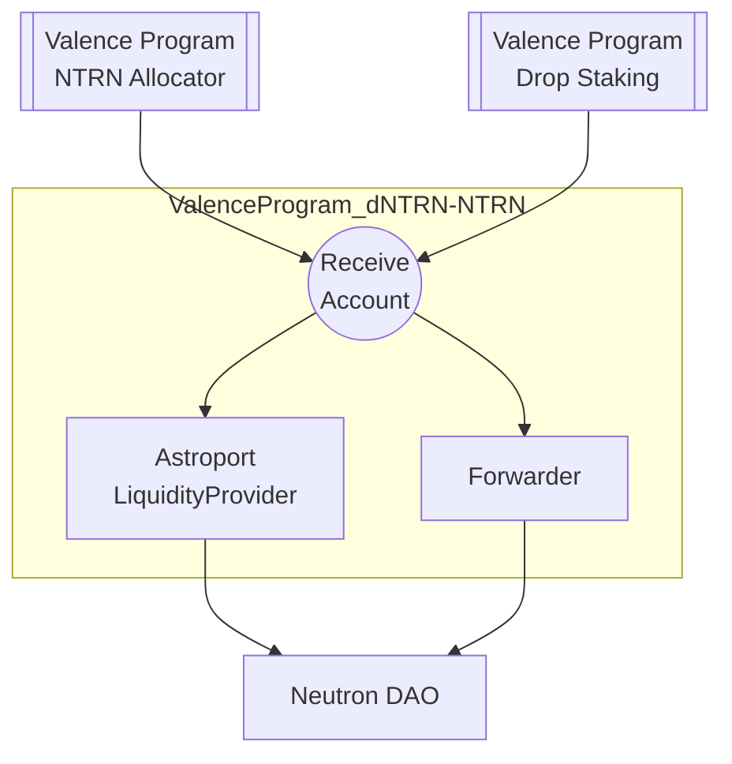

# Bootstrap NTRN-dNTRN liquidity pool (v1)

This directory provides support for building and deploying a program that bootstraps the NTRN-dNTRN liquidity pool:
- The program instantiates a single Valence Account that receives NTRN and dNTRN.
- The program provides liquidity in an Astroport Pool. Operators can provide liquidity if the expected range is within configured bounds. The Neutron DAO or the security DAO can provide double-sided liquidity at any price.
- Liquidity Tokens are sent back to the Neutron DAO.
- The security DAO can send back tokens from the receiver account back to the Neutron DAO at any time. This will typically be used to send excess funds if necessary.

## Program structure

## Configuration Parameters

### Token Configuration
- `ntrn_denom`: The denomination of the NTRN token
- `dntrn_denom`: The denomination of the dNTRN token

### Token Forwarding Configuration 

These configurations apply to the forwarder that returns tokens to the Neutron DAO.
- `ntrn_forwarder_amount`: Maximum amount of NTRN tokens to forward in a single operation. This is initially configured to a very large number so all tokens are returned.
- `dntrn_forwarder_amount`: Maximum amount of dNTRN tokens to forward in a single operation. This is initially configured to a very large number so all tokens are returned.
- `forwarder_interval_between_calls`: Minimum time (in seconds) between forward operations. This is initially set to zero so there is no wait time between calls.

### Pool Configuration
- `pool_max_spread`: Maximum spread allowed when swapping one asset for another to provide single sided liquidity
- `double_sided_min`: Minimum pool ratio (AssetA/AssetB) for double-sided liquidity provision
- `double_sided_max`: Maximum pool ratio (AssetA/AssetB) for double-sided liquidity provision
- `astroport_pool_addr`: Address of the Astroport pool contract for NTRN-dNTRN

### Authorized Actors
- `neutron_dao_addr`: Address of the Neutron DAO
- `security_dao_addr`: Address of the Security DAO
- `operator_list`: List of addresses allowed to execute operations

## Subroutines

- **secure_send_tokens_to_dao**
    - Forwards NTRN and dNTRN from receive account at configured rate and interval
    - Authority: security DAO
    - Configuration controlled by `ntrn_forwarder_amount`, `dntrn_forwarder_amount`, and `forwarder_interval_between_calls`

- **double_sided_lp**
    - Provides double-sided liquidity and sends LP tokens directly to the Neutron DAO
    - Can only provide liquidity if the pool ratio is between `double_sided_min` and `double_sided_max`
    - Authority: operators or security DAO

- **secure_double_sided_lp**
    - Provides double-sided liquidity and sends LP tokens directly to the Neutron DAO
    - Can only provide liquidity if the pool ratio is between `double_sided_min` and `double_sided_max`
    - Authority: security DAO

- **secure_single_sided_lp**
    - Provides single-sided liquidity and sends LP tokens directly to the Neutron DAO
    - Can only provide liquidity if the pool ratio is between `double_sided_min` and `double_sided_max` as well as the `max_spread` is respected.
    - Authority: security DAO

- **secure_update_return_forwarder_config**
    - Updates the configuration of the return forwarder
    - Authority: Neutron DAO and Security DAO

## Directory structure

This is a single program builder with the following structure:

- `output/` - Output directory for deployed program
- `src/` - Program source code
    - `main.rs` - Entry point to the script
    - `program_builder.rs` - Program builder code that defines the program configuration
- `program_params/` - Program parameters for different environments
    - `mainnet.toml` - Production configuration
    - `ntrn-devnet.toml` - Development network configuration
    - `ntrn-devnet-2.toml` - Secondary development network configuration

## Version History

- v1: Initial production version with basic forwarding and LP functionality